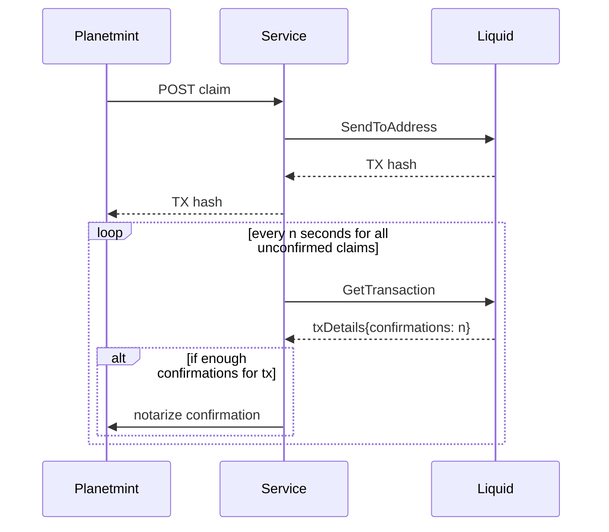

# rddl-claim-service
This service receives unconfirmed `claims` from Planetmint which are to be issued from the `pop` wallet to a `beneficiary` address on liquid. It returns the transaction hash of the liquid transaction. All received `claims` are stored and polled from liquid until enough confirmations have been received. Afterwards the confirmed `claim` is sent to Planetmint to finish the process and notarize the confirmation on chain.

**Curl example:**
```
curl -X POST -H "Content-Type: application/json" -d '{"beneficiary": "plmnt15xuq0yfxtd70l7jzr5hg722sxzcqqdcr8ptpl5", "amount":"10000.00000000", "claim-id":1}' localhost:8080/claim
```

## Routes
- `POST /claim`
- `GET /claim/:id`

## Mechanics


## Execution
The service can be executed via the following go command without having it previously built:
```
go run cmd/rddl-claim-service/main.go
```

## Configuration
The service needs to be configured via the ```./app.toml``` file or environment variables. The defaults are
```
asset = '7add40beb27df701e02ee85089c5bc0021bc813823fedb5f1dcb5debda7f3da9'
certs-path = './certs/'
confirmations = 10
db-path = './data'
log-level = 'debug'
planetmint-address = 'plmnt15xuq0yfxtd70l7jzr5hg722sxzcqqdcr8ptpl5'
planetmint-chain-id = 'planetmint-testnet-1'
rpc-host = 'planetmint-go-testnet-3.rddl.io:18884'
rpc-pass = 'password'
rpc-user = 'user'
service-host = 'localhost'
service-port = 8080
shamir-host = 'https://localhost:9091'
wait-period = 10
wallet = 'pop'
```

**Important:** The `planetmint-address` needs to be the `ClaimAddress` configured on Planetmint in order to pass the `AnteHandler` check.

## Data storage
This service stores all claims in a LevelDB on disk. This is to ensure that no claims are lost in case of failure. These are loaded from disk as soon as the service starts.